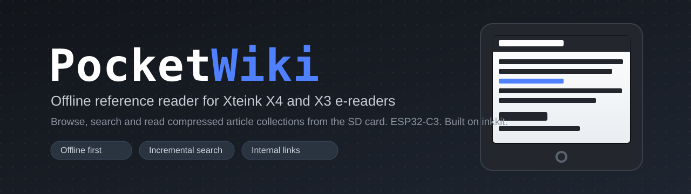
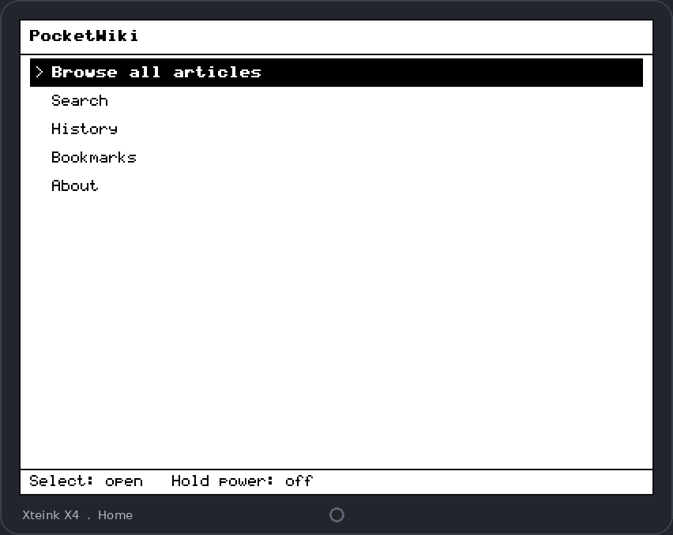
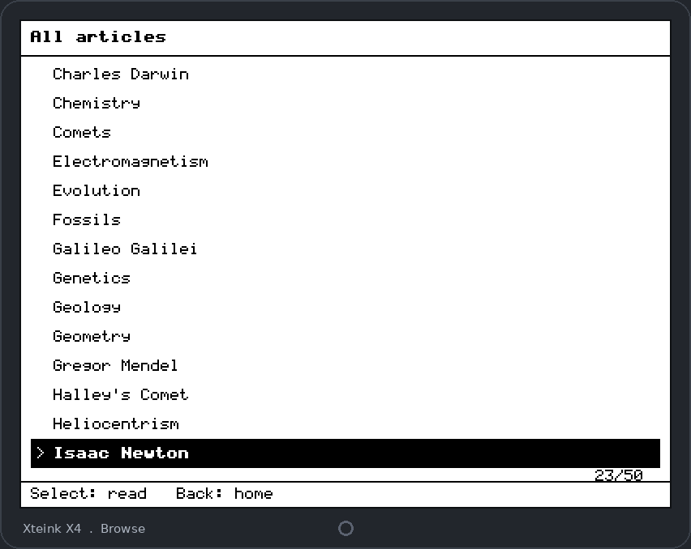
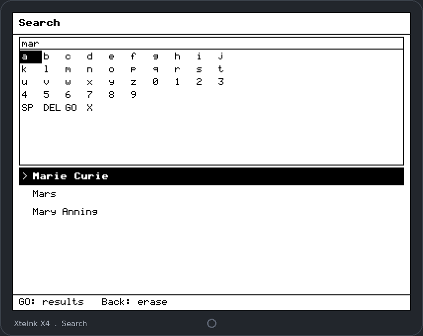
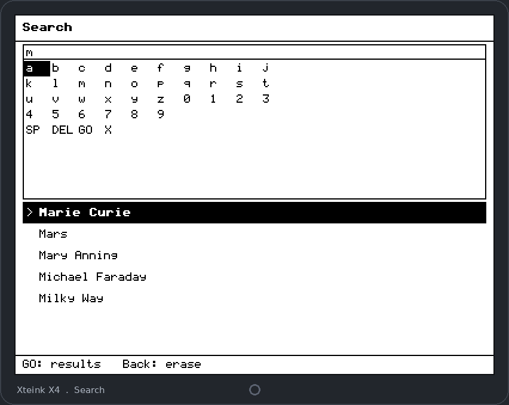

<p align="center">
  
</p>

<h1 align="center">PocketWiki</h1>

<p align="center">
  <strong>An offline Wikipedia-style reference reader for the Xteink X4 and X3 pocket e-ink devices.</strong><br>
  Browse, search and read compressed article collections straight from the SD card. No Wi-Fi, no cloud, no distractions.
</p>

<p align="center">
  
  
  
  
  
  
</p>

---

## What is PocketWiki?

**PocketWiki is open-source firmware that turns an Xteink X4 or X3 e-reader into a
fully offline reference library.** You build a compact archive on your computer
from Markdown files, Wikipedia article titles or a Kiwix ZIM subset, copy the
resulting `.pwa` file onto the SD card, and read it on the device with fast title
search, an article renderer that supports headings, bold and italic, lists and
internal links between articles, plus history and bookmarks. Every article is
pre-processed on the desktop and stored as a tiny binary, so the device (an
ESP32-C3 with only about 380 KB of RAM) never has to parse HTML and never loads a
whole file into memory.

It is built on the shared [inkkit](https://github.com/mohitagw15856/inkkit)
device layer and follows the conventions of the CrossPoint Reader ecosystem, but
it is a standalone application: it does not require CrossPoint to be installed.

> **In one line:** an offline, searchable, cross-linked encyclopaedia in your
> pocket, running on cheap e-ink hardware.

## Screenshots

These are genuine renders produced by the firmware's own drawing code against the
bundled sample archive, at an illustrative panel resolution. On device capture is
tracked in [docs/HARDWARE_TESTING.md](docs/HARDWARE_TESTING.md).

<p align="center">
  
  
</p>
<p align="center">
  
  
</p>

<p align="center">
  
  
</p>

## Features

- **Fully offline.** Everything is served from the SD card. No network is used or
  needed at read time.
- **Incremental title search.** A button driven on-screen keyboard filters titles
  as you type, and it is accent insensitive (type without accents and still match
  accented titles).
- **A real article renderer.** Headings, bold and italic, ordered and unordered
  lists, horizontal rules, and internal links that jump between articles.
- **History and bookmarks**, persisted to the SD card so they survive a power
  cycle.
- **Memory disciplined by design.** Articles are tokenised and block compressed on
  the desktop; the device inflates one small block at a time into a single
  reusable buffer.
- **A Python companion** that builds archives from Markdown, Wikipedia titles or a
  Kiwix ZIM file, and warns before an archive's index would exceed a safe on
  device memory budget.
- **Open source, MIT licensed**, with a ready made sample archive of about 50
  public domain articles.

## Quick start: put PocketWiki on your device

You need an Xteink X4 or X3, its SD card, a USB cable, and Python 3.9 or newer on
your computer.

### 1. Install PlatformIO and flash the firmware

```bash
# Install PlatformIO Core (pioarduino flavour, matching the ecosystem)
python -m pip install -U https://github.com/pioarduino/platformio-core/archive/refs/tags/v6.1.19.zip

# Clone this repository
git clone https://github.com/mohitagw15856/PocketWiki.git
cd PocketWiki

# Build and flash for the X4 (use xteink_x3 for the X3)
pio run -e xteink_x4 -t upload
```

PlatformIO fetches inkkit and the freeink-sdk automatically. If the upload port
is not detected, hold the device in bootloader mode and pass the port, for
example `-t upload --upload-port /dev/ttyACM0`.

### 2. Build a content archive

Use the bundled sample, or build your own with the companion tool:

```bash
cd companion

# Option A: from a folder of Markdown files (internal links resolve between them)
python -m pocketwiki build markdown sample_content \
    -o foundations-of-science.pwa -n "Foundations of Science"

# Option B: from a list of Wikipedia article titles (one per line)
python -m pocketwiki build wikipedia my-titles.txt -o science.pwa --lang en

# Option C: from a subset of a Kiwix ZIM file
python -m pocketwiki build zim wikipedia.zim -o subset.pwa --limit 500
```

A ready made sample lives at
`companion/sample/foundations-of-science.pwa` if you just want to try it.

### 3. Copy the archive to the SD card

1. Create a folder named `pocketwiki` at the root of the SD card.
2. Copy your `.pwa` file (or the sample) into `/pocketwiki/`.
3. Insert the card and power on the device.

That is it. If several archives are present, PocketWiki shows a picker and
remembers your last choice.

### On-device controls

| Button | In lists and menus | In the reader |
| --- | --- | --- |
| Up / Down | Move the selection | Previous / next page |
| Left / Right | Page up / page down | Previous / next page |
| Select | Open the highlighted item | Open the page menu (links, bookmark) |
| Back | Go back a screen | Return to the list |
| Hold power | Save and power off | Save and power off |

## How it works

```
Desktop (companion)                          Device (firmware)
-------------------                          -----------------
Markdown / Wikipedia / ZIM                    /pocketwiki/*.pwa on SD
        |                                             |
   parse + strip to a                          stream header + index
   tokenised render stream                            |
        |                                       binary-search titles
   per-block DEFLATE                                  |
        |                                       inflate one block at a
   write .pwa archive  ----->  SD card  ----->  time, render tokens
```

The heavy work happens once, on your computer. The device only ever streams a
compact, pre-indexed binary. See
[docs/ARCHIVE_FORMAT.md](docs/ARCHIVE_FORMAT.md) for the on disk format and
[ARCHITECTURE.md](ARCHITECTURE.md) for the design decisions.

## Frequently asked questions

### Does PocketWiki need Wi-Fi or an internet connection?

No. PocketWiki is offline first. All reading and searching happens on the device
from the SD card. The internet is only involved if you choose to build an archive
from live Wikipedia titles on your computer.

### Can I read Wikipedia offline on my Xteink with PocketWiki?

Yes. Build an archive from a list of Wikipedia article titles, or from a Kiwix ZIM
file, with the companion tool, then copy it to the SD card. Article text is
stripped to a compact form at build time so it renders quickly on the device.

### What devices are supported?

The Xteink X4 and X3, which are ESP32-C3 based e-ink readers. One firmware serves
both; the panel size is read at runtime.

### Do I need CrossPoint Reader installed?

No. PocketWiki is a standalone firmware. It shares the same device layer (inkkit)
and SD card conventions as the CrossPoint ecosystem, so the two can coexist on one
card, but PocketWiki does not depend on CrossPoint.

### How big can a collection be?

Storage is limited only by the SD card. The companion warns when a collection's
search index would exceed a safe on device memory budget (64 KB by default) and
suggests splitting very large collections into several `.pwa` files.

### What is the `.pwa` file format?

A PocketWiki Archive: a single file with a streamable title index, a per article
directory, and article bodies stored as a tokenised render stream compressed in
small DEFLATE blocks. It is fully specified in
[docs/ARCHIVE_FORMAT.md](docs/ARCHIVE_FORMAT.md).

### Is it open source?

Yes, under the MIT licence. Contributions are welcome, see
[CONTRIBUTING.md](CONTRIBUTING.md).

## Compatibility

- **Devices:** Xteink X4 and X3 (ESP32-C3). The panel size is read at runtime, so
  one firmware serves both.
- **Ecosystem:** works with the CrossPoint Reader ecosystem as of **CrossPoint
  v1.5.0**. It uses the same freeink-sdk device layer through inkkit and the same
  SD card conventions. PocketWiki is standalone and does not require CrossPoint.

## Building and testing from source

```bash
# Portable C++ core and UI widget logic (host build, no hardware needed)
cmake -S test -B test/build
cmake --build test/build -j
ctest --test-dir test/build --output-on-failure

# Companion Python tool
cd companion && python -m pip install pytest && python -m pytest -q
```

The core test build also generates a small archive with the companion and reads
it back through the C++ reader, so the two implementations of the `.pwa` format
are checked against each other on every build.

## Repository layout

| Path | What |
| --- | --- |
| `companion/` | Python CLI to build and inspect archives, plus its tests |
| `core/` | Portable, host tested C++ (archive reader, decoder, layout, models) |
| `src/` | Device firmware (screens, keyboard, inkkit wiring) |
| `hal/` | HAL interface inkkit needs but does not ship (compile shim) |
| `test/` | Native test build (CMake) |
| `tools/` | Font generator and the screenshot and media renderers |
| `docs/` | Format specification, gaps, hardware testing checklist |

## Documentation

- [ARCHITECTURE.md](ARCHITECTURE.md): design decisions and licence compatibility.
- [docs/ARCHIVE_FORMAT.md](docs/ARCHIVE_FORMAT.md): the `.pwa` on disk format.
- [docs/INKKIT_GAPS.md](docs/INKKIT_GAPS.md): what PocketWiki needed beyond inkkit.
- [docs/HARDWARE_TESTING.md](docs/HARDWARE_TESTING.md): the on device checklist.
- [companion/README.md](companion/README.md): the companion tool in detail.

## Licence

MIT, see [LICENSE](LICENSE). The vendored `puff` decompressor is under the zlib
licence (`core/third_party/puff/`). The sample article text is dedicated to the
public domain (CC0).

<p align="center"><sub>Made for tiny screens and long battery life. Keywords: offline Wikipedia e-reader, Xteink X4, Xteink X3, ESP32-C3 firmware, e-ink reference reader, Kiwix ZIM, PlatformIO, inkkit, CrossPoint Reader.</sub></p>
